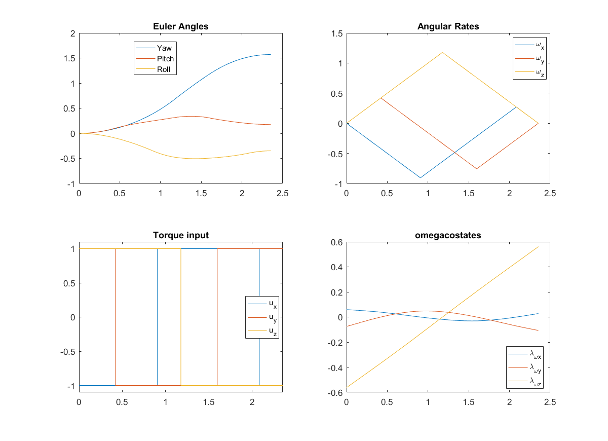

# attitudeTimeOptimalManeuvers
Time optimal rest-to-rest attitude maneuvers are solved for using the Pontryagin's Minimum Principle.
Code for solving the 3-dimensional attitude maneuvers is provided. The main scripts are in the root folder, the loop script attempts a continuation process.
The control is bounded by some L norm of the three axis torque control. The L-infinity controller can be obtained by setting a L-norm higher than 20.

Results for a given maneuver are included in results. The format of this data is directly compatible with the display code provided at the end of the main 3-dimensional script.

This maneuver is around 10% faster than the single axis of rotation maneuver for large angle maneuvers.

